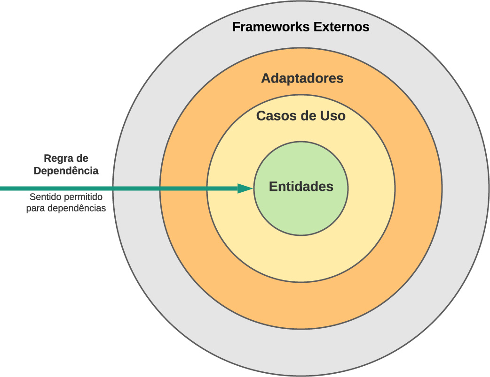
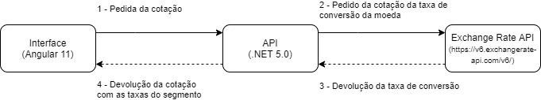
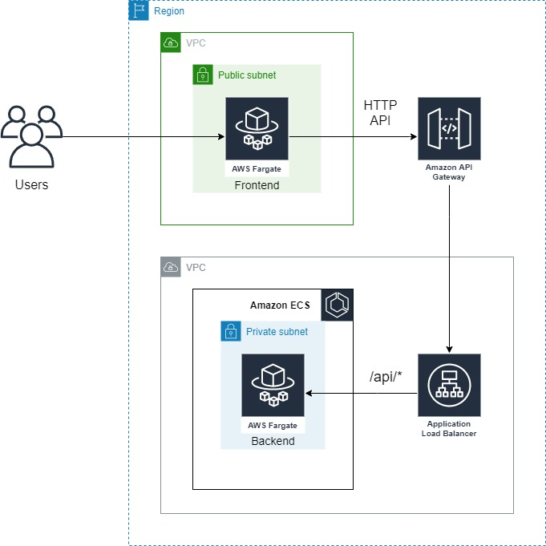
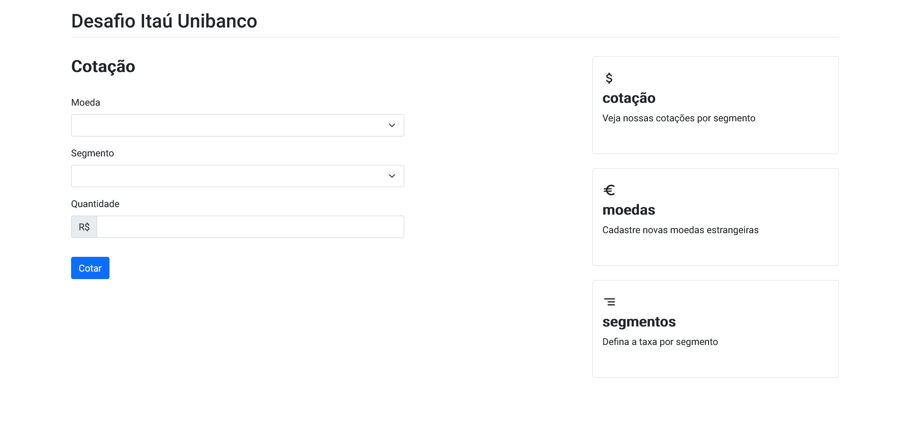
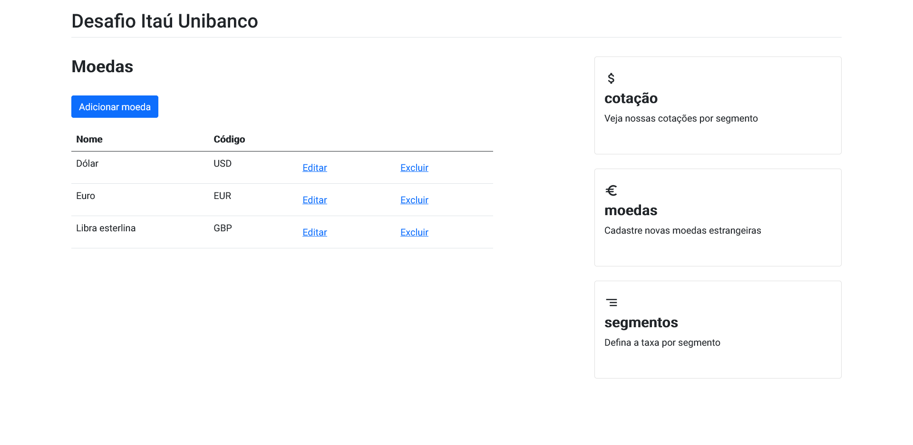
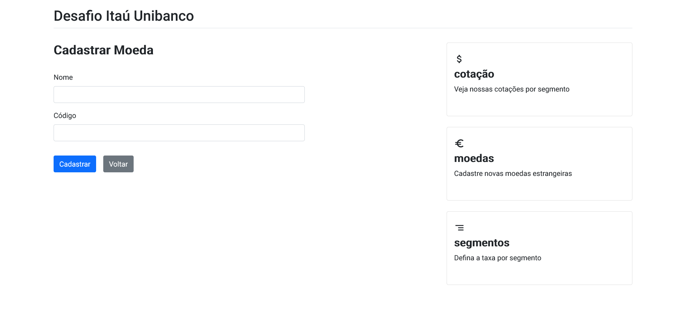
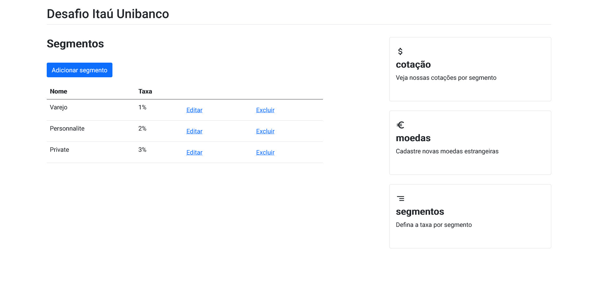
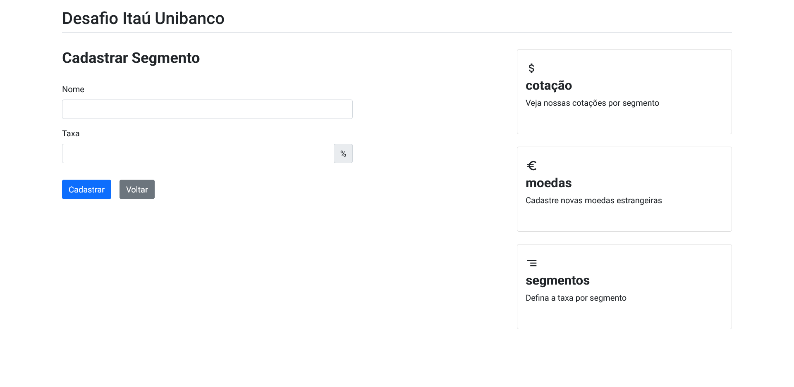

# Desafio Itaú Unibanco

Projeto desenvolvido com o intuito de ser uma aplicação de cambio de moedas, parametrizada pelo segmento do cliente.

### Funções
* Cotação de moedas com a taxa parametrizada por segmento
* Gerenciamento de segmento
* Gerenciamento de moedas disponíveis para cotação

## Arquitetura

### Arquitetura Limpa

Foi utilizada a __arquitetura limpa__ para o desenvolvimento da aplicação, devido a seu fluxo que permite que as partes mais baixas tenham um baixo grau de dependência.



## Funcionamneto

A solução funciona com 3 componentes principais, a interface do usuário, feito em angular.

Uma API interna, em .NET 5.0, que faz toda a parte de gerenciamento de moedas e segmentos.

E a API externa do Exchange Rate API, para obter a taxa de câmbio.



## Tecnologias
* .NET 5.0
* Angular 11
* AWS cdk
* Docker
* NGINX
* Swagger

## Como utilizar
### CDK

O cdk serve para definir toda a infraestrutura que a aplicação terá no AWS.

Para enviar a aplicação para o AWS através do cdk basta executar os seguintes comandos: 

```shell
cd cdk
cdk bootstrap
cdk deploy --all
```

Tanto a url do frontend quanto a da API apareceram quanto o envio do respectivo stack for enviado.

### Docker compose

Os comandos a seguir servem para iniciar a aplicação localmente usando o docker:

```shell
cd src
docker-compose up -d --build
```
O __frontend__ está disponível em `http://localhost/` enquanto a __API__ estará em `http://localhost:3000/`.

### Docker

A aplicação pode ser iniciada em partes utilizando o docker.

Para iniciar o frontend:

```shell
cd src
docker build -f "Dockerfile.web" -t desafiocambio-front:latest .
docker run -p 80:80 desafiocambio-front:latest
```

Para iniciar o backend:
```shell
cd src
docker build -t desafiocambio-backend:latest .
docker run -p 3000:80 desafiocambio-backend:latest
```
O __frontend__ está disponível em `http://localhost/` enquanto a __API__ estará em `http://localhost:3000/`.

### Docker Hub

As imagens do docker hub podem ser acessadas usando `facoliveira/desafiocambio-frontend:latest` para o frontend e `facoliveira/desafiocambio-backend:latest` para o backend.

## Swagger

O swagger está disponível quando executado localmente ou através do docker compose. Podendo ser acessado pela mesma url da API `/swagger`. Ex: `http://localhost:3000/swagger`, para o docker.

## AWS

A infraestrutura criada pela aplicação é a seguinte:



### CloudFormation

A infraestrutura do AWS pode ser montada atráves do CloudFormation usando tanto o cdk, quanto os arquivos dentro da pasta CloudFormation.

Os stacks precisam ser criados na seguinte orderm:

1. BackendStack (BackendStack.template.json)
2. ApiStack (ApiStack.template.json)
3. FrontendStack (FrontendStack.template.json)

> :warning: **Se for usar o CloudFormatuon manualmente**: Aguarde a criação de um stack terminar antes de tentar criar outro!

## Telas

### Cotação


### Moedas


### Cadastrar Moedas


### Segmentos


### Cadastrar Segmentos

